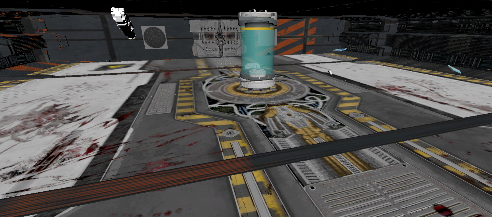
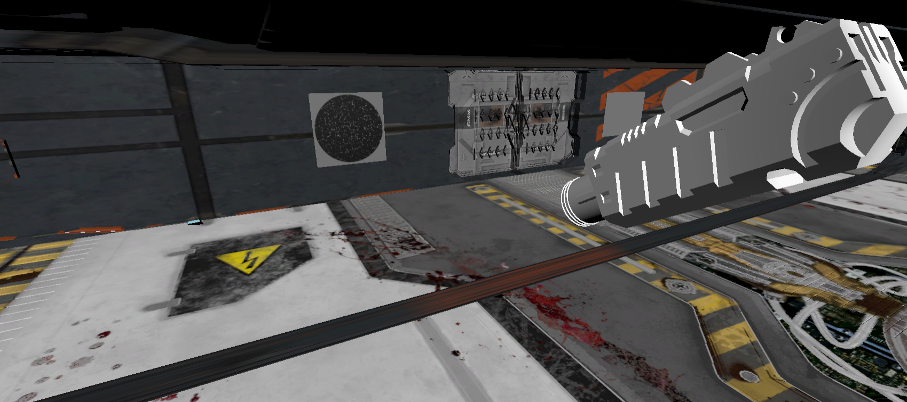
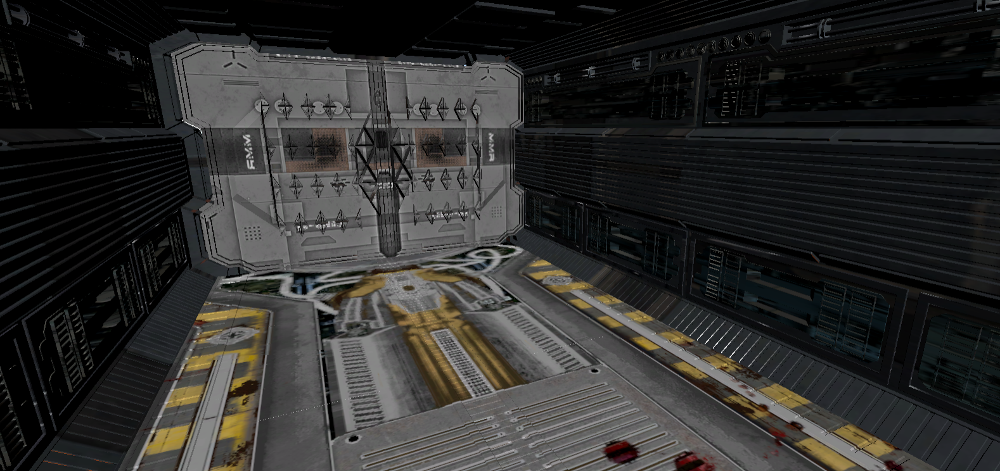

# Terminal Orbit VR

Terminal Orbit is a VR escape room game developed in Unity as a collaborative university project for **FA/DATT 4310 M – Interactive Installation Based Gaming** at York University.

Players explore a space-station environment and solve interactive puzzles to progress through the experience. This repository contains the Unity project and serves as a portfolio archive showcasing my contributions to the game's VR interactions, puzzle mechanics, and gameplay systems.

## About the Project

Terminal Orbit was designed around environmental puzzle-solving in virtual reality. Players interact with objects throughout a space-station environment and complete a sequence of puzzles before reaching the exit.

The project provided hands-on experience developing interactive VR mechanics in Unity and connecting multiple gameplay systems using C#.

## Project Links

- [Terminal Orbit – Original Team Release on itch.io](https://apeironcheung.itch.io/terminal-orbit)

## My Contributions

My work focused primarily on implementing and integrating gameplay mechanics for the escape-room portion of the project, including:

- Interactive VR puzzle mechanics using Unity and C#
- Stone tablet placement puzzle with snapping and highlighting behaviour
- Window and pyramid light-path puzzle
- Lever-controlled laser system
- Circuit-board rotation puzzle
- Fly-by pyramid/code puzzle
- Puzzle progression and interaction logic
- Exit-zone and fade-out behaviour
- Integration of puzzle objects and interactions within the VR environment

I also worked with Unity's XR systems to connect these mechanics to VR interactions.

## Technologies

- Unity
- C#
- Unity XR / XR Interaction Toolkit
- Virtual Reality development
- Git / GitHub

## Screenshots

### Space Station Environment

### Laser Puzzle

### Exit Area

## Project Status

This repository is an archived portfolio version of the project.

The original project was developed and tested using VR hardware that I no longer have access to. The Unity project, scenes, scripts, and core project files have been preserved, but the current repository has not been fully re-tested using the original VR hardware.

## Team Project

Terminal Orbit was developed as a collaborative university project. This repository is maintained as a portfolio archive of the project and my individual development contributions.

## What I Learned

Working on Terminal Orbit gave me practical experience with:

- Building interactive gameplay systems in Unity
- Programming game mechanics in C#
- Developing for VR and working with XR interactions
- Connecting multiple puzzle systems into a larger gameplay experience
- Debugging and integrating components within a team-developed Unity project
- Designing interactions around player feedback and environmental problem-solving
